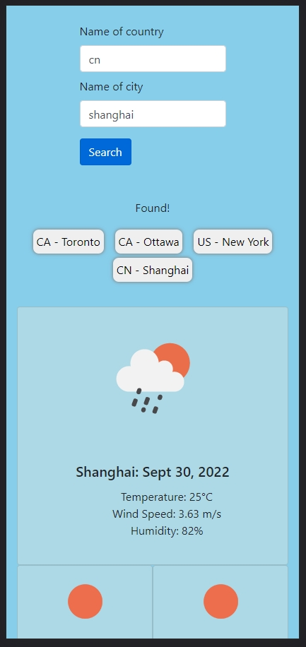

# Weather Dashboard With Server API

## This is made with JavaScript, JQuery, JQueryUI, Luxon, BootStrap and ❤️.



## Description

Github:
https://github.com/roflmelon/weather-dashboard-server-api

Live Link: https://roflmelon.github.io/weather-dashboard-server-api/

## Installation

None required. Simply search.

## Usage

```
Use the search bar to search for a city from a country.

It will show the weather for current day and 5 days from today.

After you search, your search history will be saved below the form as a button.

Click the button to revisit your previous search results.

ENJOY!!!❤️
```

## Contributing

Hao Zhou

## License

[MIT](https://choosealicense.com/licenses/mit/)
